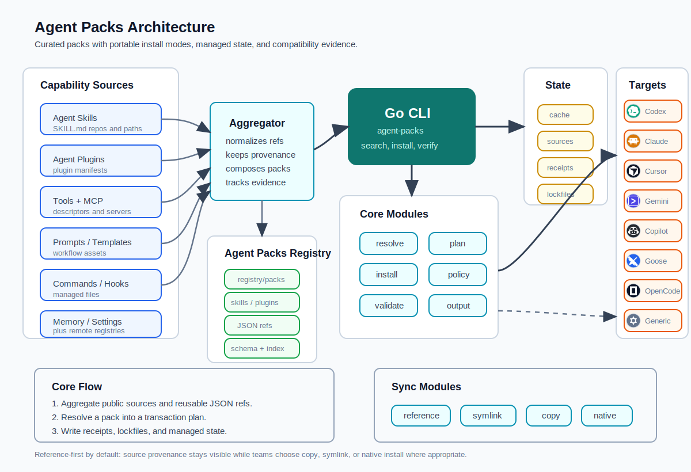

# Agent Packs

Curated, installable capability bundles for AI coding agents.

Agent Packs bundles public Skills, Plugins, commands, hooks, prompts, templates,
and composed packs into ready-to-use workflow packs.



Agent Packs aggregates capabilities from public skill repositories, Claude/Codex plugins,
prompts, templates, commands, hooks, and remote registries. The CLI
normalizes those sources into registry-backed packs, preserves provenance, writes
receipts and lockfiles, and syncs capabilities into supported coding agents through
reference, symlink, copy, or native install modes.

## Repository Layout

This repository (`agent-packs/cli`) holds the CLI. The pack/skill/plugin data
lives in a separate repo,
[`agent-packs/registry`](https://github.com/agent-packs/registry), which the CLI
fetches at runtime.

- `cli/`: Go CLI module and source.
- `skills/agent-packs/`: the bundled `agent-packs` skill installed into editors.
- `docs/`: architecture notes and the GitHub Pages site.
- `tests/`: Python CLI integration, bundled-skill, and docs tests.

The registry data (`packs/`, `skills/`, `plugins/`, `schemas/`, `policy/`,
`index.json`) is maintained in
[`agent-packs/registry`](https://github.com/agent-packs/registry).

## Build

```sh
go build -o bin/agent-packs ./cmd/agent-packs
```

## Install

Homebrew:

```sh
brew install agent-packs/tap/agent-packs
```

Bootstrap installer:

```sh
curl -fsSL https://raw.githubusercontent.com/agent-packs/cli/main/install.sh | sh
```

Or build locally from source (see Build above).

The release archive also includes a bundled `agent-packs` skill for agentic code
editors. The bootstrap installer copies it to `~/.codex/skills/agent-packs` by
default so agents can help users search, install, author, validate, and debug
Agent Packs. Set `AGENT_PACKS_AGENT` to install it for another supported editor,
`AGENT_PACKS_INSTALL_SKILL=0` to skip this step, or `AGENT_PACKS_SKILL_DIR` to
choose a custom skill directory.

```sh
curl -fsSL https://raw.githubusercontent.com/agent-packs/cli/main/install.sh | AGENT_PACKS_AGENT=opencode sh
curl -fsSL https://raw.githubusercontent.com/agent-packs/cli/main/install.sh | AGENT_PACKS_AGENT=claude sh
```

## Registry

The pack/skill/plugin registry lives in a separate repo,
[`agent-packs/registry`](https://github.com/agent-packs/registry). The CLI fetches
it on first use and caches it under your user cache dir (e.g.
`~/.cache/agent-packs/registry`); `agent-packs update` refreshes that cache.

Override registry resolution with environment variables:

- `AGENT_PACKS_REGISTRY` — path to a local `packs/` directory (skips fetching;
  ideal for working on the registry or for air-gapped/offline use).
- `AGENT_PACKS_REGISTRY_REPO` — a different registry repo URL (e.g. a fork).
- `AGENT_PACKS_REGISTRY_REF` — pin to a branch, tag, or commit for reproducibility.

To author packs, clone the registry and point the CLI at it:

```sh
git clone https://github.com/agent-packs/registry
cd registry
AGENT_PACKS_REGISTRY=./packs agent-packs validate packs
AGENT_PACKS_REGISTRY=./packs agent-packs new pack my-pack --dir packs
AGENT_PACKS_REGISTRY=./packs agent-packs index --output index.json
```

## CLI Usage

```sh
bin/agent-packs search
bin/agent-packs show frontend-engineer
bin/agent-packs install frontend-engineer --target ./sandbox
bin/agent-packs install frontend-engineer pr-review popular-engineering-skills --target ./sandbox
bin/agent-packs install frontend-engineer --agent codex --only skills --dry-run
bin/agent-packs skills install ./my-skill --agent codex --mode copy --target ./sandbox
bin/agent-packs plugins install claude-code-review --mode native --method claude-marketplace --marketplace claude-plugins-official --package code-review --dry-run
bin/agent-packs init --agent codex --mode reference --scope project .
bin/agent-packs version
```

Additional commands:

```sh
bin/agent-packs search frontend --json
bin/agent-packs search --tool codex --scope project --review-status reviewed --details
bin/agent-packs show frontend-engineer --json
bin/agent-packs audit frontend-engineer --json
bin/agent-packs upgrade frontend-engineer pr-review --target ./sandbox
bin/agent-packs rollback frontend-engineer pr-review --target ./sandbox
bin/agent-packs tree eng-leader
bin/agent-packs publish --check
bin/agent-packs registry add local /path/to/agent-packs
bin/agent-packs install local/frontend-engineer --dry-run
bin/agent-packs install eng-leader --target-tool codex --mode symlink --on-conflict backup --project .
bin/agent-packs cache
bin/agent-packs update --all
bin/agent-packs outdated
bin/agent-packs scan ~/.codex/skills
bin/agent-packs import ~/.codex/skills
bin/agent-packs lint eng-leader
bin/agent-packs verify eng-leader
bin/agent-packs resolve eng-leader
bin/agent-packs policy check eng-leader default
bin/agent-packs licenses eng-leader
bin/agent-packs attribution eng-leader
bin/agent-packs diff frontend-engineer --target ./sandbox
bin/agent-packs pin frontend-engineer --target ./sandbox
bin/agent-packs pin frontend-engineer --target ./sandbox --check
bin/agent-packs compat eng-leader --agent codex
bin/agent-packs cache prune
bin/agent-packs list --target ./sandbox
bin/agent-packs uninstall frontend-engineer pr-review --target ./sandbox
bin/agent-packs doctor
bin/agent-packs doctor targets
```

## Included Packs

- `frontend-engineer`: frontend implementation and browser verification workflows.
- `frontend-quality`: frontend UI engineering, browser verification, and performance checks.
- `pr-review`: code review and pull request inspection workflows.
- `eng-leader`: engineering leadership workflows for strategy, planning, quality, architecture decisions, delivery, launch readiness, security, and performance. Several skills reference Addy Osmani's public `addyosmani/agent-skills` repository via upstream source metadata.
- `product-discovery`: interview, idea refinement, spec writing, and task breakdown workflows.
- `implementation-core`: context engineering, source-grounded development, API design, incremental implementation, and TDD workflows.
- `reliability-debugging`: debugging, adversarial review, test hardening, and security hardening workflows.
- `shipping-ops`: git workflow, CI/CD, launch readiness, migrations, and ADR/documentation workflows.
- `full-lifecycle-engineer`: composed lifecycle pack from discovery through implementation, review, release, and follow-up.
- `popular-engineering-skills`: broadly useful public engineering skills selected from high-visibility lifecycle skill repositories.
- `popular-claude-dev-plugins`: common Claude Code development plugins from Anthropic's official plugin directory.
- `popular-integration-plugins`: common Claude Code integration plugins for GitHub, GitLab, Playwright, Context7, Linear, Firebase, Terraform, and semantic code tooling.
- `popular-agent-starter`: a composed starter bundle combining popular engineering skills and Claude Code development plugins.
- `ai-engineer`, `backend-engineer`, `cloud-infrastructure`, `data-engineer`, `database-reliability`, `devex-engineer`, `ml-engineer`, `mobile-engineer`, `open-source-maintainer`, `platform-engineer`, `qa-engineer`, `rust-engineer`, `security-engineer`, and `sre-engineer`: role-focused packs for common engineering specialties.
- `superpowers`: a composed pack for `obra/superpowers`, plus focused Superpowers workflow, quality/debugging, collaboration/subagent, meta-authoring, and distribution-plugin packs.

The `popular-*` packs use public proxies for adoption because most skill/plugin
ecosystems do not publish install counts. Selection signals include official or
curated marketplace presence, repository popularity, broad workflow coverage, and
common agentic coding use cases.

## Tool Target Matrix

Agent Packs knows common global and project skill directories for supported coding tools. Use `agent-packs doctor targets` to inspect the matrix. Install with `--agent <tool>` or `--target-tool <tool>`. Project installs use the tool's project skill directory, for example Codex project installs target `.agents/skills`.

Supported tools include `codex`, `claude`, `cursor`, `gemini`, `copilot`, `goose`, `opencode`, and `generic`. Common aliases such as `claude-code` map to `claude`.

## Project Configuration

Initialize a project config with defaults for agent, sync mode, and install scope:

```sh
bin/agent-packs init --agent codex --mode reference --scope project .
```

This writes `.agent-packs.yaml` in the project directory.

## Installation Model

Agent Packs orchestrates native install flows instead of replacing them.

- Pack-level `skills` and `plugins` entries are source references. They are recorded in plans, receipts, and lockfiles, but are not copied into the target.
- `source` is the location or command the installer resolves. Prefer pinned commit refs for reproducibility.
- Optional `upstreamSource` is only for attribution/provenance when `source` is not enough.
- Registry skills point at remote sources with `metadata.agentpacks.source`.
- Registry plugins reference their `repository` or `homepage` when available; otherwise they reference their registry directory.
- Inline local skill capabilities can still be copied into the selected agent skill target when a pack explicitly declares them under `capabilities`.
- Inline remote skill capabilities can still be fetched with `git` when the source is a Git URL or a GitHub `/tree/<branch>/<path>` URL.
- Sync modes are explicit: `reference` records sources only, `symlink` links materialized skills, `copy` copies skills plus command/hook files, and `native` enables native plugin planning.
- Conflicts are controlled with `--on-conflict skip|overwrite|backup`.
- Inline plugin install and uninstall commands are preview-safe by default and only run with `--execute-plugins`.
- Lifecycle commands accept multiple pack IDs directly: `install`, `upgrade`, `rollback`, and `uninstall` run packs sequentially and fail fast on the first error.
- Installed packs write receipts under `<target>/receipts/`.
- Installed packs write lockfiles under `<target>/packs/<pack-id>/agent-pack.lock`.
- `uninstall` removes installed inline skill folders, managed command/hook files, and receipts. Plugin cleanup commands run only with `uninstall --execute-plugins`; otherwise plugins are reported for native/manual cleanup.
- Standalone `skills` and `plugins` commands manage independent capabilities under `<target>/receipts/skills/` and `<target>/receipts/plugins/` without requiring a pack wrapper.

## Lifecycle Commands

Agent Packs supports a basic package-manager lifecycle:

- `cache`: shows and creates central source/cache/lock/registry directories under the Agent Packs home.
- `update --all`: refreshes configured registries.
- `outdated`: lists installed packs with pack-version drift and capability revision drift (`--json` supported).
- `install <pack...>`: installs one or more packs with shared target, agent, mode, conflict, and plugin execution settings. Use `--only skills|plugins|memory|settings|commands|hooks` to install one capability family from a mixed pack.
- `upgrade <pack...>`: re-installs one or more packs using each pack's prior receipt settings.
- `rollback <pack...>`: restores one or more previous receipt-backed install states when history exists.
- `uninstall <pack...>`: removes one or more installed packs, including installed inline skill folders, optional plugin cleanup commands, and receipts.
- `skills install|list|upgrade|uninstall`: manages independent registry or local Agent Skills without wrapping them in a pack. `list` also discovers skills installed outside the standalone path, annotating each with a `source` column: `managed` (standalone receipt), `pack:<id>` (materialized by a pack install), or `external` (present on disk in a tool's skill directory with no receipt).
- `plugins install|list|upgrade|uninstall`: manages independent registry or local plugins; pass `--method`, `--package`, `--marketplace`, `--command`, or `--uninstall-command` to store native lifecycle metadata outside a pack. `list` also surfaces plugins pulled in by a pack install with a `pack:<id>` source.
- `audit <pack>`: supply-chain SBOM report (`--json` supported).
- `version`: prints CLI version (`--json` supported).
- `init [dir]`: writes `.agent-packs.yaml` project defaults.
- `new pack|skill|plugin|command|hook|memory|settings <id>`: scaffolds valid starter manifests.
- `tree <pack>` / `deps <pack>`: shows composed packs, referenced capabilities, sources, and trust.
- `publish --check`: runs contributor checks before opening a registry PR, including non-blocking metadata coverage warnings for requirements, provenance refs, and verification freshness (`--json` includes the coverage report).
- `scan [path]`: discovers existing `SKILL.md` files.
- `import <skills-dir>`: copies discovered skills into `<target>/sources/imported/`.
- `lint <pack>`: validates pack metadata.
- `verify <pack>`: expands a pack, checks duplicate/missing capability sources, and warns about moving remote refs.
- `resolve <pack>`: classifies sources as local, GitHub tree, pinned, or moving refs.
- `policy check <pack> <policy.json|preset>`: enforces allow/deny source rules, pinned refs, and native-command policy. Built-in presets live under `registry/policy/`, for example `default`, `ci`, and `strict`.
- `licenses <pack>` and `attribution <pack>`: report license and source attribution.
- `index [--output path]`: generates a searchable registry index.
- `diff <pack>`: compares the installed lockfile with the current registry pack.
- `pin <pack> [--check]`: resolves each installed capability's moving ref to a concrete commit and content checksum and records them in the lockfile; `--check` re-resolves the live sources and fails if any drifted from the recorded pins.
- `compat <pack> --agent <tool>`: checks tool compatibility metadata.
- `cache prune|clean`: removes cached state; `clean` also removes imported sources.

## Remote Registries

Registries are named sources stored in `<target>/registries.json`.

```sh
bin/agent-packs registry add official https://github.com/agent-packs/registry --target ~/.agent-packs
bin/agent-packs registry list --target ~/.agent-packs
bin/agent-packs install official/frontend-engineer --target ~/.agent-packs
bin/agent-packs registry remove official --target ~/.agent-packs
```

A registry source can be a local repository path or a Git URL. Remote registries are cloned into `<target>/registries/<name>/` and resolved from either `registry/packs/` or `packs/`.

## Specifying Plugins And Skills

Plugins and skills are declared as entries in `capabilities`. Plugin entries must include `format` and `install` metadata so an installer can resolve the marketplace/package/command. Skill entries must include `format` and `entry` so an installer can locate the `SKILL.md` file. Any capability can include optional `upstreamSource` when separate provenance metadata is useful.

```json
{
  "type": "plugin",
  "name": "Anthropic Claude Code code-review plugin",
  "source": "https://github.com/anthropics/claude-plugins-official/tree/main/plugins/code-review",
  "format": "anthropic-plugin",
  "entry": ".claude-plugin/plugin.json",
  "requiresExecution": true,
  "trust": "official",
  "install": {
    "method": "claude-marketplace",
    "marketplace": "claude-plugins-official",
    "package": "code-review",
    "command": "claude plugin install code-review@claude-plugins-official",
    "uninstall": "claude plugin uninstall code-review@claude-plugins-official"
  }
}
```

```json
{
  "type": "skill",
  "name": "Microsoft Azure Agent Skills",
  "source": "https://github.com/MicrosoftDocs/Agent-Skills/tree/main/skills",
  "format": "agent-skill",
  "entry": "SKILL.md",
  "targets": [".claude/skills/", ".codex/skills/", ".github/skills/"]
}
```

## Specifying Memory And Settings

Beyond skills and plugins, packs can declare **`memory`** and **`settings`**
capabilities. Unlike skills (which install a whole directory), these **merge a
fragment into a file the agent already owns** — the agent's durable instruction
markdown or its JSON/TOML settings — and are cleanly retracted on uninstall.

A **`memory`** capability carries its body inline as `content`, or points at a
markdown file with `source`. The same body is written as a managed block into
each agent's native memory file:

```json
{
  "type": "memory",
  "name": "House Rules",
  "content": "Always run the test suite before committing.\nPrefer small, focused PRs."
}
```

```json
{
  "type": "memory",
  "name": "House Rules",
  "source": "./memory/house-rules.md"
}
```

The block is delimited by stable markers keyed to the pack and capability, so
re-installing replaces it in place and uninstall removes exactly it:

```markdown
<!-- BEGIN agent-packs:my-pack/house-rules -->
Always run the test suite before committing.
Prefer small, focused PRs.
<!-- END agent-packs:my-pack/house-rules -->
```

For GitHub Copilot path-specific instructions, add `applyTo`; Agent Packs writes
the fragment to `.github/instructions/<name>.instructions.md` with the required
frontmatter:

```json
{
  "type": "memory",
  "name": "TypeScript Review Rules",
  "applyTo": "src/**/*.{ts,tsx}",
  "content": "Prefer explicit return types on exported functions."
}
```

A **`settings`** capability carries a JSON object fragment that is deep-merged
into the agent's settings file. JSON-backed agents receive JSON. Codex receives
add-only TOML in `.codex/config.toml`, converted from the same JSON fragment.
Use the optional `mergeKey` to scope the merge to a dotted key path (e.g.
`mcpServers`):

```json
{
  "type": "settings",
  "name": "Default model and guardrails",
  "content": "{\"model\":\"opus\",\"permissions\":{\"deny\":[\"rm -rf\"]}}"
}
```

```json
{
  "type": "settings",
  "name": "Filesystem MCP server",
  "mergeKey": "mcpServers",
  "content": "{\"filesystem\":{\"command\":\"npx\",\"args\":[\"-y\",\"@modelcontextprotocol/server-filesystem\"]}}"
}
```

Where each capability lands per agent (empty cells skip with an `unsupported`
status — the rest of the pack still installs):

| Agent | Memory | Settings |
| --- | --- | --- |
| `claude` | `CLAUDE.md`, `.claude/CLAUDE.md`, `~/.claude/CLAUDE.md` | `.claude/settings.json`, `.claude/settings.local.json`, `~/.claude/settings.json` |
| `codex` | `AGENTS.md`, `AGENTS.override.md`, `~/.codex/AGENTS.md` | `.codex/config.toml`, `~/.codex/config.toml` |
| `gemini` | `GEMINI.md` / `.gemini/GEMINI.md` | `.gemini/settings.json` |
| `copilot` | `.github/copilot-instructions.md`, `.github/instructions/*.instructions.md`, `AGENTS.md` | — |
| `goose` | `.goosehints` | — |
| `opencode` | `AGENTS.md`, `~/.config/opencode/AGENTS.md` | `opencode.json`, `~/.config/opencode/opencode.json` |
| `generic` | `AGENTS.md` | — |

`agent-packs doctor targets` prints the live matrix, and
`agent-packs doctor targets --json` includes destination metadata such as
`verified`, `sourceURL`, and `default`. Merge semantics are **user-wins,
add-only**: an existing key or hand-written prose is never overwritten, and
uninstall restores the file to its original state. Merges only happen with an
explicit `--mode copy` — in the default `reference` mode the capability is
recorded but the file is left untouched, so a plain `install` never edits a
user's config:

```sh
# Records intent only (default reference mode) — no file is modified.
agent-packs install my-pack --agent claude

# Actually merges the fragments into CLAUDE.md / settings.json.
agent-packs install my-pack --agent claude --mode copy

# Install only durable instructions or only settings from a mixed pack.
agent-packs install my-pack --agent codex --only memory --mode copy
agent-packs install my-pack --agent codex --only settings --mode copy
```

`agent-packs status` reports drift if a managed memory block or a pack-owned
settings key is later hand-edited. `status --json` includes the target agent and
destination path for each checked fragment.

> Generated auto-memory stores are intentionally not edited. Agent Packs writes
> documented durable instruction/config files only. Cursor remains unsupported
> until its target docs are verified; Goose memory is available as an
> experimental markdown target, but Goose settings are not enabled in v1.

## Specifying Commands And Hooks

Packs can also declare **`command`** and **`hook`** capabilities. In v1 these
are managed files: `reference` mode records intent only, while `--mode copy`
writes the command or hook file, tracks a content hash in the receipt, reports
drift if the file is edited or removed, and deletes the managed file on
uninstall/rollback.

Commands and hooks can use inline `content` or a `source` file. Directory
sources require `entry`. Claude Code commands install to `.claude/commands/*.md`
by default; other agents use portable `.agent-packs/commands/*.md` and
`.agent-packs/hooks/*.json` destinations unless a pack provides an
`agentTargets` override for a documented native path.

Installing a hook writes a file the target agent may run automatically, so hook
writes are opt-in: in `--mode copy` a hook is only written when you pass
`--allow-hooks` (parallel to `--execute-plugins`). Without the flag the hook is
recorded with a content preview and a note in the plan, but not written.
Commands are not gated.

```json
{
  "type": "command",
  "name": "Review PR",
  "content": "Review the current pull request for correctness, tests, and release risk.",
  "format": "markdown"
}
```

```json
{
  "type": "hook",
  "name": "Pre Review",
  "content": "{\"event\":\"preReview\",\"steps\":[\"git status --short\",\"detect test command\"]}",
  "format": "json"
}
```

Install only commands or hooks from a mixed pack:

```sh
agent-packs install my-pack --agent claude --only commands --mode copy
agent-packs install my-pack --agent codex --only hooks --mode copy --allow-hooks
```

## Pack Composition

Packs can include other packs with the `packs` field. They can also include reusable source references with `skills` and `plugins`. `skills` and `plugins` entries can be registry ID strings or objects with their own remote `source`. Included packs and referenced capabilities are expanded before install.

```json
{
  "id": "review-combo",
  "name": "Review Combo Pack",
  "version": "0.1.0",
  "description": "Composes review-oriented packs.",
  "packs": ["pr-review"],
  "skills": [
    "frontend-implementation-guidance",
    {
      "id": "remote-planning-skill",
      "source": "https://github.com/addyosmani/agent-skills/tree/main/skills/planning-and-task-breakdown",
      "format": "agent-skill",
      "entry": "SKILL.md"
    }
  ],
  "plugins": [
    "browser-verification-workflow",
    {
      "id": "remote-code-review-plugin",
      "source": "https://github.com/anthropics/claude-plugins-official/tree/main/plugins/code-review",
      "format": "anthropic-plugin",
      "entry": ".claude-plugin/plugin.json"
    }
  ]
}
```

Reusable skills live as Agent Skills at `skills/<id>/SKILL.md` (in the registry repo). Reusable plugins live as Claude Code plugins at `plugins/<id>/.claude-plugin/plugin.json`. A pack can reference them by ID, or bypass local registry entries by using object refs with remote `source` URLs. The CLI treats both forms as references rather than installable copies.

Agent Skills follow the Agent Skills specification: a skill directory with required `SKILL.md` frontmatter fields `name` and `description`. Claude Code plugins follow the plugin manifest layout with `.claude-plugin/plugin.json` and a required `name` field. Use `metadata.agentpacks.source` on registry skills and `repository` or `homepage` on registry plugins to point at the remote source.

Registry entries can include catalog metadata such as `maintainers`, `stability`,
`lastVerified`, `reviewStatus`, `deprecated`, `replacement`, and `requirements`.
These fields power registry search, publish checks, and the static catalog.

## Examples

Example manifests live in the registry repo under `schemas/examples/`:

- `minimal-pack.json`: the smallest valid pack manifest.
- `full-pack.json`: a complete manifest showing every supported capability type.
- `real-world-pack.json`: examples based on public Claude Code plugin and Agent Skills repositories.
- `composed-pack.json`: a pack that includes another pack.
- `referenced-capabilities-pack.json`: a pack that includes reusable `skills` and `plugins` entries.

## Tests

```sh
go test ./...
python3 -m unittest discover -s tests
```

## Core Concepts

- Pack: a curated bundle for a role, stack, workflow, or task.
- Categories/tools/scope: searchable facets for registry discovery and install intent.
- Skill: an instruction module, often `SKILL.md`.
- Plugin: a packaged agent extension, such as an Anthropic/Claude Code plugin.
- Command: a reusable prompt/command file installed into an agent command
  directory or portable Agent Packs command directory.
- Hook: a reusable automation fragment installed as a managed file. Native hook
  activation is target-specific and should use `agentTargets` until verified.
- Tool: shell command, API connector, or executable integration.
- Recipe: recommended combinations of packs for a larger use case.

## License

Apache-2.0
