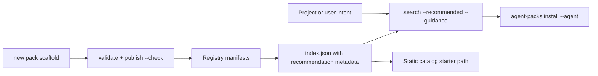

# Architecture

Agent Packs should feel like Homebrew for agent capabilities while keeping the CLI and registry separable.

## Production Stack

- CLI: Go module at the repository root, split into focused packages (`model`, `registry`, `resolve`, `plan`, `install`, `policy`, `validate`, `targets`, `config`, `output`, `version`).
- Registry packs: static JSON manifests under `registry/packs/`.
- Registry skills: Agent Skill source references under `registry/skills/<id>/SKILL.md`.
- Registry plugins: Claude Code plugin source references under `registry/plugins/<id>/.claude-plugin/plugin.json`.
- Registry reusable capability descriptors: JSON manifests under `registry/commands/`, `registry/hooks/`, `registry/subagents/`, `registry/prompts/`, `registry/templates/`, `registry/tools/`, `registry/memory/`, `registry/settings/`, and `registry/mcp/`.
- Schema: `registry/schemas/agent-pack.schema.json`.
- Catalog metadata: maintainers, stability, review status, deprecation, replacement, last verified date, tool/version requirements, recommendation path/order/reason, use cases, and example prompts.
- Policy defaults: `registry/policy/default.json`.
- Receipts: `<target>/receipts/<pack-id>.json`.
- Lockfiles: `<target>/packs/<pack-id>/agent-pack.lock`, including source revision fields when locally resolvable.
- Project config: `.agent-packs.yaml` for default agent, mode, scope, and target.

## CLI Commands

Implemented commands:

- `agent-packs search [query] [--json] [--guidance]`
- `agent-packs show <pack> [--json]`
- `agent-packs install <pack|registry/pack>`
- `agent-packs skills install <skill-id|path>`
- `agent-packs plugins install <plugin-id|path>`
- `agent-packs commands|hooks|subagents|prompts|templates|tools|memory|settings|mcp install <id|path>`
- `agent-packs list [--json]`
- `agent-packs uninstall <pack>`
- `agent-packs upgrade <pack>`
- `agent-packs rollback <pack>`
- `agent-packs audit <pack> [--json]`
- `agent-packs version [--json]`
- `agent-packs init [dir]`
- `agent-packs new <pack|skill|plugin|command|hook|subagent|prompt|template|tool|memory|settings> <id>`
- `agent-packs doctor`
- `agent-packs doctor targets`
- `agent-packs validate <file-or-directory>`
- `agent-packs registry add <name> <source>`
- `agent-packs registry list`
- `agent-packs registry remove <name>`
- `agent-packs update --all`
- `agent-packs outdated [--json]`
- `agent-packs cache`
- `agent-packs scan [path]`
- `agent-packs import <skills-dir>`
- `agent-packs lint <pack>`
- `agent-packs verify <pack>`
- `agent-packs resolve <pack>`
- `agent-packs tree|deps <pack> [--json]`
- `agent-packs publish --check [--json]`
- `agent-packs policy check <pack> <policy.json|preset>`
- `agent-packs licenses <pack>`
- `agent-packs attribution <pack>`
- `agent-packs index [--output path]`
- `agent-packs diff <pack>`
- `agent-packs pin <pack> [--check]`
- `agent-packs check [--policy policy.json|preset] [--json]`
- `agent-packs compat <pack> [--json]`
- `agent-packs cache prune|clean`

## Install Experience

Target install experience:

```sh
brew install agent-packs/tap/agent-packs
agent-packs install frontend-engineer
```

Bootstrap fallback:

```sh
curl -fsSL https://raw.githubusercontent.com/agent-packs/cli/main/install.sh | sh
```

Release binaries are built by `.github/workflows/release.yml` on version tags (`v*`).
Release archives bundle both the `skills/agent-packs` skill and the `registry/`
so the binary works standalone. The bootstrap installer installs the skill to
the selected editor's skill directory with `AGENT_PACKS_AGENT` (defaults to
Codex) and copies the registry to `~/.local/share/agent-packs/registry`. The
Homebrew formula installs the registry under `share/agent-packs/registry`; the
CLI resolves the default registry from `<prefix>/share/agent-packs/registry`
when `AGENT_PACKS_REGISTRY` is unset.

The Homebrew tap is linked to CLI releases. On a `v*` tag, the CLI release
workflow publishes archives and checksums, then dispatches
`agent-packs/homebrew-tap` using the required `HOMEBREW_TAP_TOKEN` secret. The
tap workflow reads the latest `agent-packs/cli` release, downloads
`checksums.txt`, regenerates the formula, validates syntax, and commits only
when the formula version changes. The tap workflow can still be run manually for
operator repair, but release tags are the normal automation path.

## Discovery And Authoring Flow



`search --guidance` is intentionally opt-in so existing tabular search consumers
stay stable. Guidance distinguishes advertised target tools from explicit
compatibility evidence and suggests a dry-run or compatibility inspection when
evidence is missing, partial, unknown, or unsupported.

`recommendation` lives in registry manifests and is projected into `index.json`
as both the structured object and a simple `recommended` boolean. The catalog
uses that index metadata for the starter path, with only a compatibility
fallback for older indexes.

`new pack` emits richer draft metadata (`requirements`, `useCases`,
`examplePrompts`, categories, tools, scope, and trust-bearing refs), but it does
not generate `lastVerified` or verified compatibility evidence. Those fields
should only be added after real validation.

## Catalog And CI

CLI CI (`.github/workflows/ci.yml`) runs Go tests, builds the CLI, runs Python
integration/docs tests, prepares the static catalog, and deploys GitHub Pages.
Registry CI runs registry schema/index tests; release/publish readiness also
uses CLI-backed `validate`, `index --check`, and `publish --check` gates before
pushing registry changes.

`docs/catalog.html` renders `registry/index.json` as a lightweight catalog.

## Security Posture

Plugin install and uninstall commands are not executed unless the user passes `--execute-plugins`. Plugin execution uses a timeout, respects `AGENT_PACKS_PLUGIN_CWD`, and supports structured handlers for `claude-marketplace` and `manual` lifecycle methods. Any non-plugin capability with an install or uninstall command must declare `requiresExecution: true`; tool descriptors are never executed by Agent Packs v1.

Standalone capability commands write receipts under `<target>/receipts/<kind>/`, keeping independent capability lifecycle state separate from pack receipts.

Plugin capabilities with install or uninstall commands should set `requiresExecution: true` and should include trust metadata such as `trust: "official"` or `trust: "community"`.

Integrity metadata uses `integrity.checksum` (`sha256:` for a single entry file, `dirsha256:` for a whole skill directory tree) and optional `integrity.signature` (`sha256:`). Checksums are verified against the materialized source *before* any file is placed in the agent's live skill directory, so a mismatch never exposes tampered content. Fresh `agent-packs pin` runs record `dirsha256:` tree digests covering every file in the skill, and `pin --check`/`check` fail closed: a recorded pin whose source can no longer be resolved (deleted repo, network failure) reports `UNVERIFIABLE` and fails the gate instead of silently passing.

The target matrix maps supported tools to global and project skill directories, with aliases such as `claude-code` → `claude`. Registry skills and plugins are referenced from their upstream source and are not copied into the selected agent target by default (`--mode reference`).

Commands, hooks, subagents, prompts, templates, and tools are managed file
capabilities. In `reference` mode they are recorded only. In `copy` mode, Agent
Packs writes a single file from inline `content` or a materialized source file,
records a content hash in the receipt, checks drift with `status`, and removes
the file on uninstall/rollback. Claude Code commands and subagents use verified
`.claude/commands/*.md` and `.claude/agents/*.md` destinations; other agents fall
back to portable `.agent-packs/commands/*.md`, `.agent-packs/hooks/*.json`,
`.agent-packs/agents/*.md`, `.agent-packs/prompts/*.md`,
`.agent-packs/templates/*.md`, and `.agent-packs/tools/*.json` destinations
unless a pack supplies an `agentTargets` override. `targets` remains metadata;
`agentTargets.scope` selects global, project, or target-scoped destinations.

## Merge Capabilities (Memory And Settings)

`memory` and `settings` capabilities differ from skills/plugins: instead of owning a whole filesystem object, they merge a fragment into a file the agent already owns (durable instruction markdown such as `CLAUDE.md`/`AGENTS.md`/`GEMINI.md`, Copilot `.instructions.md` files, or JSON/TOML settings such as `.claude/settings.json` and `.codex/config.toml`). The target matrix carries verified `instructionDestinations[]` and `settingsDestinations[]` entries with scope, format, source URL, and default markers. Unsupported `(agent, type, scope)` combinations install as `unsupported` skips.

The `internal/merge` engine implements markdown, JSON, and TOML strategies. Memory uses an idempotent managed markdown block delimited by `<!-- BEGIN/END agent-packs:<pack>/<capability> -->` markers; Copilot path-specific rules render `applyTo` frontmatter before the managed block is installed. JSON settings use a deep add-only merge with leaf-level ownership tracking. Codex TOML settings accept JSON or TOML fragments and append only missing keys. All strategies are **user-wins, add-only** (an existing key or user prose is never overwritten), record exactly what they injected (`ownedKeys`, `contentHash`, `blockId`) in the receipt, and write atomically (temp-file + rename) under a per-file lock. Uninstall and rollback retract only the recorded fragment so the file returns to its original state, and `status` reports drift when a managed block or owned key is hand-edited.

In the default `reference` mode merge capabilities are only recorded; the file is modified only with an explicit `--mode copy`, so a plain `install` never edits a user's config. Generated auto-memory stores are intentionally not edited. Comment-preserving YAML settings and direct Cursor/Goose settings support are deferred until their target docs are verified.

Remote sources support GitHub tree/commit URLs, GitLab tree URLs, generic git URLs, and archive downloads (`.tar.gz`, `.zip`). Moving refs can be resolved live with `git ls-remote` for outdated reporting.

## Why Go

Go is the safest default for a brew-like developer tool:

- Single binary distribution.
- Fast startup.
- Good filesystem and archive support.
- Easy release automation with GitHub Actions.
- Clean cross-compilation.
- Familiar enough for infrastructure-oriented contributors.
